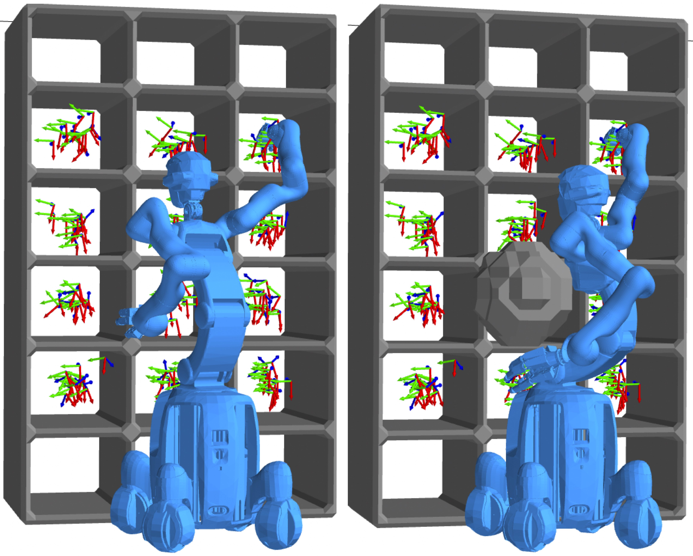
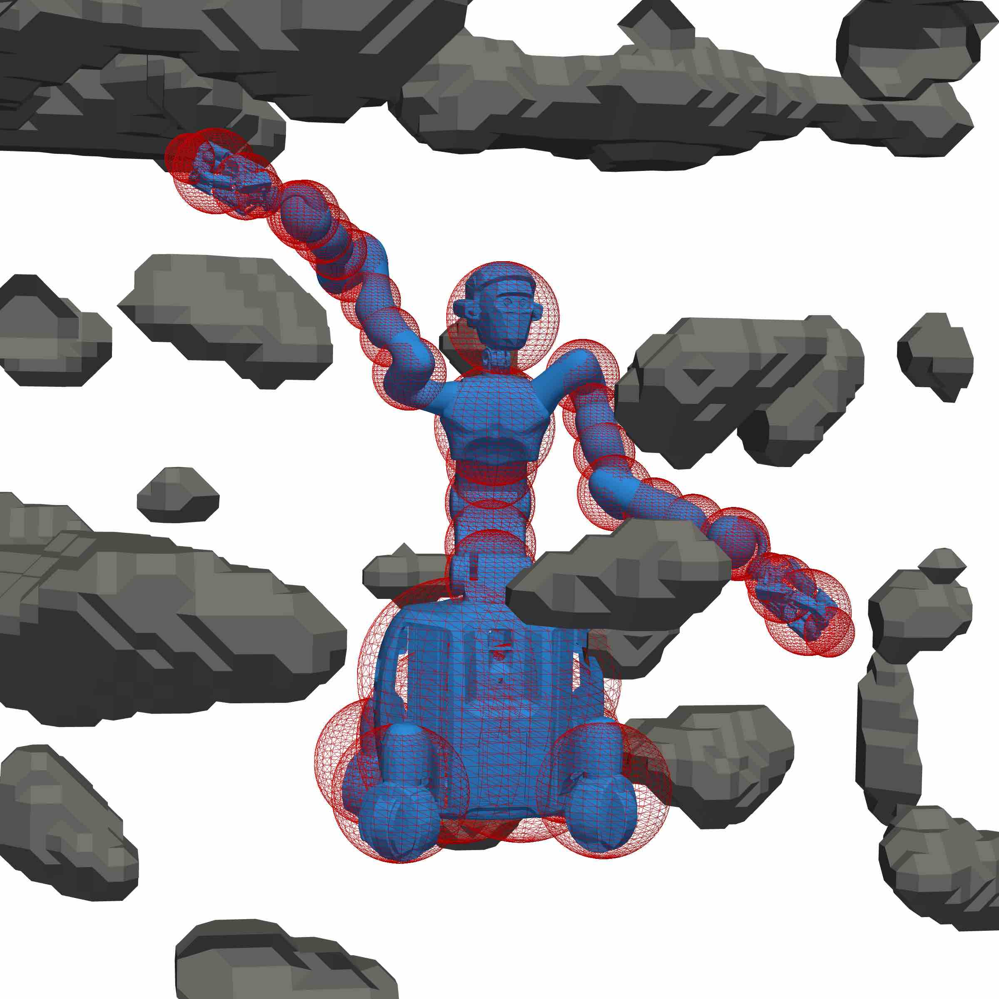

This site complements our research on fast whole-body collision-free motion planning. 
For more information, please refer to one of the papers below.

### [Self-Contained Calibration of an Elastic Humanoid Upper Body Using Only a Head-Mounted RGB Camera](_pages/humanoids23.md)
Humanoids 2023 by
[Johannes Tenhumberg](https://scholar.google.com/citations?user=2RZuYZMAAAAJ){:target="_blank"} 
[Arman Mielke](https://www.ki.uni-stuttgart.de/institute/team/Mielke-00002/){:target="_blank"} and
[Berthold Bäuml](https://scholar.google.com/citations?hl=en&user=fjvpDsEAAAAJ){:target="_blank"}.

[Full Paper](https://arxiv.org/abs/2311.05938){:target="_blank"} /
[Video](https://www.youtube.com/watch?v=k96r7l2s384&list=PLbECwYTsgi4ZYIeFTpNmKQj4UHipQI_gT&index=3){:target="_blank"}

{:.this 
style="width: 400px; 
display: block;
margin-left: auto;
margin-right: auto"}

---
### [Speeding Up Optimization-based Motion Planning through Deep Learning](_pages/iros22.md)
IROS 2022 by
[Johannes Tenhumberg](https://scholar.google.com/citations?user=2RZuYZMAAAAJ){:target="_blank"},
[Darius Burschka](https://scholar.google.com/citations?user=y-MzVoUAAAAJ){:target="_blank"} and 
[Berthold Bäuml](https://scholar.google.com/citations?hl=en&user=fjvpDsEAAAAJ){:target="_blank"}.

[Full Paper](https://arxiv.org/abs/2311.08345){:target="_blank"} /
[Video](https://www.youtube.com/watch?v=fKe1_vUNCew&list=PLbECwYTsgi4ZYIeFTpNmKQj4UHipQI_gT&index=8){:target="_blank"}

{:.this 
style="width: 400px; 
display: block;
margin-left: auto;
margin-right: auto"}
